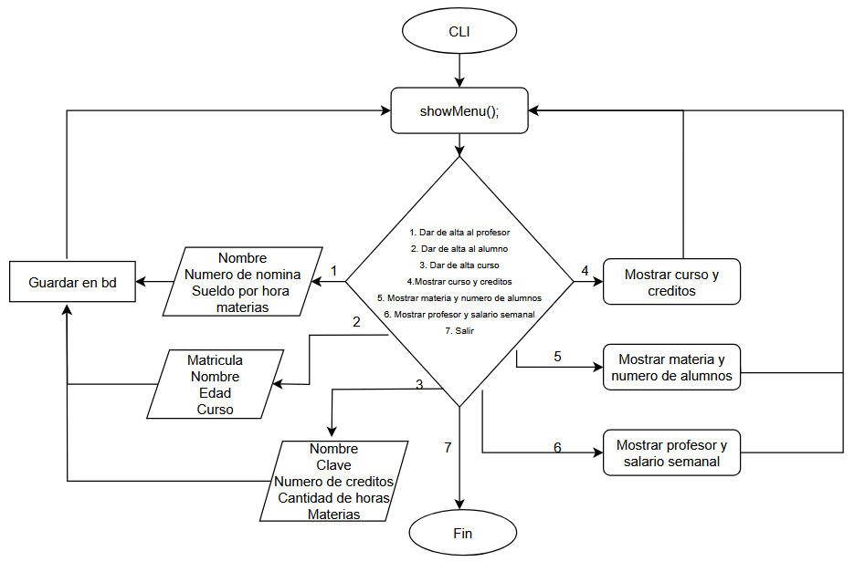

# Actividad 4

## Funcionales

### 1. **Dar de alta al profesor**

**Status**: Se puede marcar como vigente o no vigente

#### **Reglas de negocio de profesor**
#### - Salario
- 1 materia: 250
- 2 materias: 250 + 25% 
- 3 materias: 250 + 50%
- 4 materias: 250 + 75%
- El limite son 4 materias

### 2. **Dar de alta al alumno**
Permitir que el alumno se registre

### 3. **Dar de alta el curso**
#### **Reglas de negocio curso**

#### - Alumnos
- Minimo 6 alumnos por curso
- Maximo 22 alumnos por curso
#### - Materias 
- Un curso puede tener un maximo de 3 materias
- Creditos

### 4. **Dar Curso y creditos**
- Imprimir el curso solicitado con su numero de creditos

### 5. **Materia y numero de alumnos**
- Imprimir la materia solicitada y el numero de alumnos que tiene la materia 

### 6. **Profesor y salario semanal**
- Imprimir el profesor solicitado y el salario del profesor solicitado

## No funcionales

### 1. **Base de datos**
- El sistema debe de contener una base de datos que almacene la informacion de los profesores, de los alumnos y de los cursos

### 2. **CLI**
- El sistema debe de contar con una interfaz por linea de comandos(CLI)

# Diagramas

## **Diagrama de flujo**

## **Diagrama de clases**
